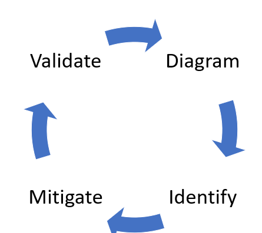

what is Thread Modelling ?

Threat modeling is a process by which potential threats, such as structural vulnerabilities can be identified, enumerated, and prioritized. The purpose of threat modeling is to identify, communicate, and understand threats and mitigations within the context of protecting something of value.

**A threat model typically includes:**

* Description of the subject to be modeled

* Assumptions that can be checked or challenged in the future as the threat landscape changes

* Potential threats to the system

* Actions that can be taken to mitigate each threat

* A way of validating the model and threats, and verification of success of actions taken

**Top Thread Modelling Framework**

* STRIDE

* OWASP Top 10

* MITRE ATT&CK

**Let  take STRIDE thread modelling**

STRIDE is a threat modeling framework developed by Microsoft employees and published in 1999. The STRIDE threat model is focused on the potential impacts of different threats to a system:

* Spoofing

* Tampering

* Repudiation

* Information disclosure

* Denial of service

* Escalation of privileges

